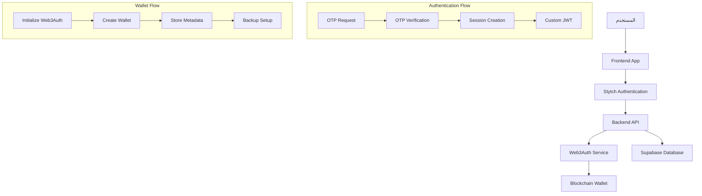
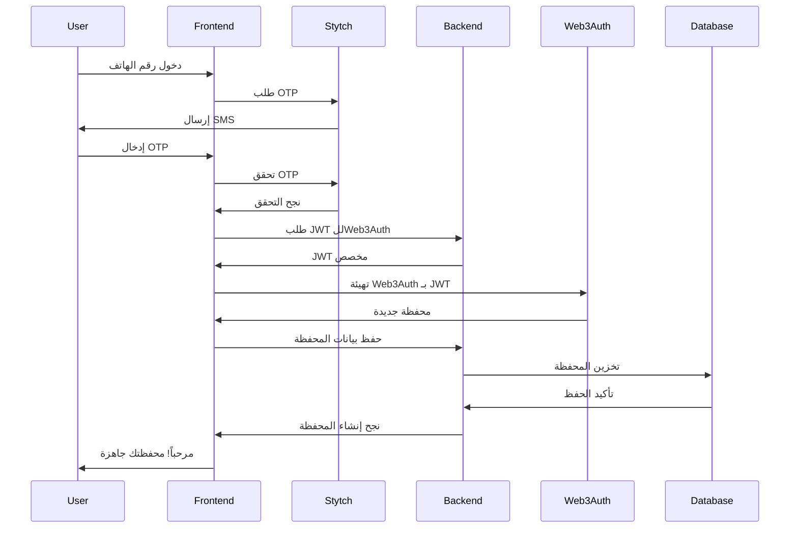
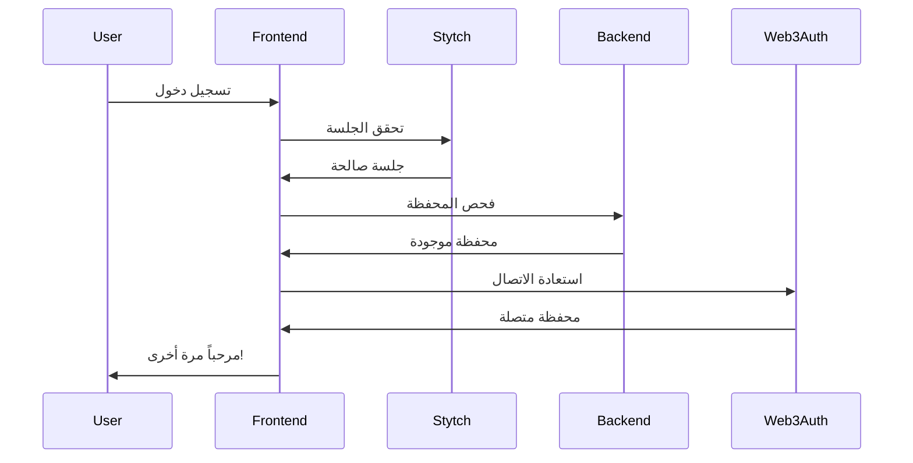

# 🔗 **دليل التكامل: Stytch + Web3Auth**

## 📋 **نظرة عامة**

يوفر هذا الدليل شرحاً مفصلاً لكيفية تكامل **Stytch** مع **Web3Auth** في تطبيق 7awel، مما يمكن المستخدمين من:

- 🔐 **المصادقة** عبر Stytch (SMS, WhatsApp, Email)
- 💰 **إنشاء محافظ رقمية** عبر Web3Auth
- 🔄 **الحفاظ على UX موحد** دون تعقيد إضافي
- 🛡️ **الأمان المتقدم** مع النسخ الاحتياطي

---

## 🏗️ **Architecture Overview**



---

## 🚀 **التنفيذ العملي**

### **1. إعداد متغيرات البيئة**

```bash
# Web3Auth Configuration
WEB3AUTH_CLIENT_ID=your-web3auth-client-id
WEB3AUTH_VERIFIER=stytch-7awel-verifier
WEB3AUTH_NETWORK=mainnet

# JWT للتكامل
JWT_SECRET=your-super-secret-jwt-key

# Blockchain Networks
ETHEREUM_RPC_URL=https://mainnet.infura.io/v3/your-key
POLYGON_RPC_URL=https://polygon-rpc.com
```

### **2. Frontend Integration**

#### **A. إعداد Web3Auth**

```javascript
// frontend/src/services/web3auth.js
import { Web3Auth } from "@web3auth/modal";
import { CHAIN_NAMESPACES } from "@web3auth/base";

const clientId = process.env.REACT_APP_WEB3AUTH_CLIENT_ID;

const web3auth = new Web3Auth({
  clientId,
  web3AuthNetwork: "mainnet",
  chainConfig: {
    chainNamespace: CHAIN_NAMESPACES.EIP155,
    chainId: "0x1", // Ethereum mainnet
    rpcTarget: "https://mainnet.infura.io/v3/your-key",
  },
  uiConfig: {
    theme: "dark",
    loginMethodsOrder: ["custom"],
    appLogo: "https://app.7awel.com/logo.png",
    appName: "7awel Wallet"
  }
});
```

#### **B. تدفق المصادقة**

```javascript
// frontend/src/hooks/useAuth.js
import { useState, useEffect } from 'react';
import { StytchProvider } from '@stytch/react';
import { web3auth } from '../services/web3auth';

export const useAuth = () => {
  const [user, setUser] = useState(null);
  const [wallet, setWallet] = useState(null);
  const [isLoading, setIsLoading] = useState(false);

  // 1. مصادقة Stytch
  const authenticateWithStytch = async (phoneNumber) => {
    setIsLoading(true);
    try {
      // إرسال OTP
      const otpResponse = await fetch('/api/v1/auth/otp/send', {
        method: 'POST',
        headers: { 'Content-Type': 'application/json' },
        body: JSON.stringify({
          medium: 'phone',
          value: phoneNumber,
          channel: 'sms'
        })
      });

      if (!otpResponse.ok) throw new Error('Failed to send OTP');
      return otpResponse.json();
    } catch (error) {
      console.error('Authentication error:', error);
      throw error;
    } finally {
      setIsLoading(false);
    }
  };

  // 2. التحقق من OTP وإنشاء الجلسة
  const verifyOTPAndCreateSession = async (phoneNumber, otp) => {
    setIsLoading(true);
    try {
      const verifyResponse = await fetch('/api/v1/auth/otp/verify', {
        method: 'POST',
        headers: { 'Content-Type': 'application/json' },
        body: JSON.stringify({
          medium: 'phone',
          value: phoneNumber,
          otp,
          includeWeb3AuthToken: true // طلب JWT للWeb3Auth
        })
      });

      if (!verifyResponse.ok) throw new Error('Invalid OTP');
      
      const result = await verifyResponse.json();
      setUser(result.data.user);
      
      // إذا توفر Web3Auth token، إنشاء المحفظة
      if (result.data.web3auth) {
        await initializeWallet(result.data.web3auth.token);
      }
      
      return result;
    } catch (error) {
      console.error('OTP verification error:', error);
      throw error;
    } finally {
      setIsLoading(false);
    }
  };

  // 3. إنشاء المحفظة عبر Web3Auth
  const initializeWallet = async (customJWT) => {
    try {
      await web3auth.init();
      
      if (!web3auth.connected) {
        const web3authProvider = await web3auth.connectTo("custom", {
          verifier: "stytch-7awel-verifier",
          verifierId: user.stytchId,
          idToken: customJWT
        });
        
        const accounts = await web3authProvider.request({
          method: "eth_accounts"
        });
        
        if (accounts.length > 0) {
          const walletAddress = accounts[0];
          
          // حفظ المحفظة في قاعدة البيانات
          await saveWalletToDatabase(walletAddress);
          
          setWallet({
            address: walletAddress,
            provider: web3authProvider,
            isConnected: true
          });
        }
      }
    } catch (error) {
      console.error('Wallet initialization error:', error);
      throw error;
    }
  };

  // 4. حفظ المحفظة في قاعدة البيانات
  const saveWalletToDatabase = async (address) => {
    try {
      const response = await fetch('/api/v1/wallets', {
        method: 'POST',
        headers: {
          'Content-Type': 'application/json',
          'Authorization': `Bearer ${localStorage.getItem('sessionToken')}`
        },
        body: JSON.stringify({
          address,
          network: 'ethereum',
          backupMethods: ['device', 'cloud']
        })
      });

      if (!response.ok) {
        throw new Error('Failed to save wallet');
      }

      return response.json();
    } catch (error) {
      console.error('Save wallet error:', error);
      throw error;
    }
  };

  return {
    user,
    wallet,
    isLoading,
    authenticateWithStytch,
    verifyOTPAndCreateSession,
    initializeWallet
  };
};
```

#### **C. مكون الـ Login**

```javascript
// frontend/src/components/Login.js
import React, { useState } from 'react';
import { useAuth } from '../hooks/useAuth';

const Login = () => {
  const [step, setStep] = useState('phone'); // 'phone' | 'otp' | 'wallet'
  const [phoneNumber, setPhoneNumber] = useState('');
  const [otp, setOtp] = useState('');
  const [error, setError] = useState(null);
  
  const { authenticateWithStytch, verifyOTPAndCreateSession, isLoading } = useAuth();

  const handleSendOTP = async (e) => {
    e.preventDefault();
    try {
      await authenticateWithStytch(phoneNumber);
      setStep('otp');
      setError(null);
    } catch (err) {
      setError(err.message);
    }
  };

  const handleVerifyOTP = async (e) => {
    e.preventDefault();
    try {
      const result = await verifyOTPAndCreateSession(phoneNumber, otp);
      
      if (result.data.web3auth) {
        setStep('wallet');
      } else {
        // المستخدم مصادق بنجاح، يمكن إعداد المحفظة لاحقاً
        window.location.href = '/dashboard';
      }
      
      setError(null);
    } catch (err) {
      setError(err.message);
    }
  };

  if (step === 'phone') {
    return (
      <div className="login-container">
        <h2>مرحباً بك في 7awel</h2>
        <form onSubmit={handleSendOTP}>
          <input
            type="tel"
            placeholder="رقم الهاتف"
            value={phoneNumber}
            onChange={(e) => setPhoneNumber(e.target.value)}
            required
          />
          <button type="submit" disabled={isLoading}>
            {isLoading ? 'جاري الإرسال...' : 'إرسال كود التحقق'}
          </button>
        </form>
        {error && <p className="error">{error}</p>}
      </div>
    );
  }

  if (step === 'otp') {
    return (
      <div className="login-container">
        <h2>أدخل كود التحقق</h2>
        <p>تم إرسال كود إلى {phoneNumber}</p>
        <form onSubmit={handleVerifyOTP}>
          <input
            type="text"
            placeholder="كود التحقق"
            value={otp}
            onChange={(e) => setOtp(e.target.value)}
            maxLength={6}
            required
          />
          <button type="submit" disabled={isLoading}>
            {isLoading ? 'جاري التحقق...' : 'تحقق وإنشاء المحفظة'}
          </button>
        </form>
        {error && <p className="error">{error}</p>}
      </div>
    );
  }

  if (step === 'wallet') {
    return (
      <div className="login-container">
        <h2>🎉 تم إنشاء محفظتك بنجاح!</h2>
        <p>محفظتك الرقمية جاهزة للاستخدام</p>
        <button onClick={() => window.location.href = '/dashboard'}>
          الذهاب للوحة التحكم
        </button>
      </div>
    );
  }
};

export default Login;
```

### **3. Backend APIs**

#### **A. إنشاء JWT للWeb3Auth**

```javascript
// POST /api/v1/wallets/auth/token
curl -X POST http://localhost:8000/api/v1/wallets/auth/token \
  -H "Authorization: Bearer YOUR_SESSION_TOKEN" \
  -H "Content-Type: application/json"

// Response
{
  "success": true,
  "data": {
    "token": "eyJhbGciOiJIUzI1NiIsInR5cCI6IkpXVCJ9...",
    "verifier": "stytch-7awel-verifier",
    "clientId": "your-web3auth-client-id",
    "expiresIn": 86400
  }
}
```

#### **B. إنشاء محفظة جديدة**

```javascript
// POST /api/v1/wallets
curl -X POST http://localhost:8000/api/v1/wallets \
  -H "Authorization: Bearer YOUR_SESSION_TOKEN" \
  -H "Content-Type: application/json" \
  -d '{
    "address": "0x742d35Cc6634C0532925a3b8D0A0E461e241aD5F",
    "network": "ethereum",
    "backupMethods": ["device", "cloud"]
  }'

// Response
{
  "success": true,
  "data": {
    "wallet": {
      "id": "uuid",
      "address": "0x742d35Cc6634C0532925a3b8D0A0E461e241aD5F",
      "network": "ethereum",
      "provider": "web3auth",
      "status": "active",
      "backup_methods": ["device", "cloud"],
      "created_at": "2024-01-15T10:30:00Z"
    },
    "isPrimary": true
  }
}
```

#### **C. الحصول على حالة المحفظة**

```javascript
// GET /api/v1/wallets/status
curl -X GET http://localhost:8000/api/v1/wallets/status \
  -H "Authorization: Bearer YOUR_SESSION_TOKEN"

// Response
{
  "success": true,
  "data": {
    "hasWallet": true,
    "primaryWallet": {
      "id": "uuid",
      "address": "0x742d35Cc6634C0532925a3b8D0A0E461e241aD5F",
      "network": "ethereum",
      "provider": "web3auth",
      "status": "active",
      "createdAt": "2024-01-15T10:30:00Z",
      "lastUsed": "2024-01-15T12:45:00Z"
    },
    "needsSetup": false
  }
}
```

---

## 🔄 **تدفقات العمل (Workflows)**

### **1. تدفق المستخدم الجديد**



### **2. تدفق المستخدم الحالي**



---

## 🛡️ **الأمان والحماية**

### **1. حماية JWT**

```javascript
// backend/services/web3AuthService.js
createCustomJWT(user, supabaseUser) {
  const payload = {
    iss: 'https://api.7awel.com',
    aud: this.web3AuthClientId,
    sub: user.stytchId,
    email: user.email,
    phone: user.phoneNumber,
    verified: true,
    iat: Math.floor(Date.now() / 1000),
    exp: Math.floor(Date.now() / 1000) + (24 * 60 * 60), // 24 hours
    verifier: this.web3AuthVerifier,
    verifierId: user.stytchId
  };

  return jwt.sign(payload, this.jwtSecret, { algorithm: 'HS256' });
}
```

### **2. التحقق من صحة العناوين**

```sql
-- database/migrations/006_create_wallets_table.sql
CREATE OR REPLACE FUNCTION is_valid_ethereum_address(address TEXT)
RETURNS BOOLEAN AS $$
BEGIN
    RETURN address ~ '^0x[a-fA-F0-9]{40}$';
END;
$$ LANGUAGE plpgsql;

ALTER TABLE wallets 
ADD CONSTRAINT valid_ethereum_address 
CHECK (is_valid_ethereum_address(address));
```

### **3. Row Level Security**

```sql
-- الأمان على مستوى الصفوف
ALTER TABLE wallets ENABLE ROW LEVEL SECURITY;

CREATE POLICY "Users can view their own wallets" ON wallets
    FOR SELECT USING (user_id = auth.uid());

CREATE POLICY "Users can insert their own wallets" ON wallets
    FOR INSERT WITH CHECK (user_id = auth.uid());
```

---

## 🔧 **استكشاف الأخطاء**

### **مشاكل شائعة وحلولها**

#### **1. خطأ في إنشاء JWT**

```bash
❌ Error: Failed to create JWT: jwt secret is required
```

**الحل:**
```bash
# تأكد من وجود JWT_SECRET في .env
JWT_SECRET=your-super-secret-jwt-key-here
```

#### **2. فشل اتصال Web3Auth**

```bash
❌ Error: Web3Auth initialization failed
```

**الحل:**
```javascript
// تحقق من صحة الإعدادات
const config = {
  clientId: process.env.REACT_APP_WEB3AUTH_CLIENT_ID, // ✅
  network: "mainnet", // أو "testnet" للتطوير
  chainConfig: {
    chainId: "0x1", // Ethereum mainnet
    rpcTarget: "https://mainnet.infura.io/v3/YOUR_KEY"
  }
};
```

#### **3. عنوان محفظة غير صالح**

```bash
❌ Error: Invalid Ethereum address format
```

**الحل:**
```javascript
// التحقق من تنسيق العنوان
const isValidAddress = (address) => {
  return /^0x[a-fA-F0-9]{40}$/.test(address);
};

if (!isValidAddress(walletAddress)) {
  throw new Error('Invalid wallet address format');
}
```

---

## 📊 **مراقبة وتحليل الأداء**

### **1. إحصائيات المحافظ**

```javascript
// GET /api/v1/wallets/stats
{
  "success": true,
  "data": {
    "totalActiveWallets": 1250,
    "networkDistribution": {
      "ethereum": 850,
      "polygon": 400
    },
    "providerDistribution": {
      "web3auth": 1200,
      "metamask": 50
    },
    "walletsLast30Days": 300,
    "walletsLast7Days": 75
  }
}
```

### **2. نشاطات المحفظة**

```javascript
// تسجيل الأنشطة تلقائياً
await logUserActivity(
  userId,
  'Wallet created',
  'wallet_created',
  {
    wallet_address: address,
    network: 'ethereum',
    provider: 'web3auth'
  }
);
```

---

## 🚀 **نشر المشروع**

### **1. متغيرات الإنتاج**

```bash
# Production Environment
NODE_ENV=production
WEB3AUTH_CLIENT_ID=your-production-client-id
WEB3AUTH_NETWORK=mainnet
ETHEREUM_RPC_URL=https://mainnet.infura.io/v3/your-key
CORS_ORIGIN=https://app.7awel.com
```

### **2. تشغيل Migration**

```bash
# تطبيق migration للمحافظ
npm run migrate

# أو يدوياً عبر Supabase
psql -d your_database -f database/migrations/006_create_wallets_table.sql
```

### **3. اختبار التكامل**

```bash
# اختبار APIs
npm run test:integration

# اختبار Web3Auth
npm run test:web3auth

# اختبار نقطة النهاية
curl -X GET https://api.7awel.com/api/v1/wallets/config
```

---

## 📱 **أمثلة للتطبيق المحمول**

### **React Native Integration**

```javascript
// mobile/src/services/web3auth.js
import { Web3Auth } from '@web3auth/react-native-sdk';

const web3auth = new Web3Auth({
  clientId: 'your-client-id',
  network: 'mainnet',
  redirectUrl: 'com.7awel.wallet://auth',
});

export const initializeWallet = async (customJWT) => {
  try {
    await web3auth.init();
    
    const loginResponse = await web3auth.loginWithJWT({
      verifier: 'stytch-7awel-verifier',
      verifierId: userId,
      idToken: customJWT
    });
    
    return loginResponse;
  } catch (error) {
    console.error('Mobile wallet init error:', error);
    throw error;
  }
};
```

---

## 🎯 **الخطوات التالية**

### **1. ميزات مستقبلية**

- 🔄 **Multi-factor Authentication**
- 🌐 **Multi-chain Support** (BSC, Avalanche)
- 💱 **Built-in DEX Integration**
- 📊 **Advanced Analytics Dashboard**
- 🤖 **AI-powered Security Monitoring**

### **2. تحسينات الأداء**

- ⚡ **Caching Layer** لبيانات المحافظ
- 🔄 **Background Sync** للمعاملات
- 📱 **Offline Support** للعمليات الأساسية
- 🚀 **CDN Integration** للملفات الثابتة

### **3. تجربة المستخدم**

- 🎨 **UI/UX Improvements**
- 🌙 **Dark/Light Theme**
- 🌍 **Multi-language Support**
- ♿ **Accessibility Features**

---

## 📞 **الدعم والمساعدة**

### **الموارد**

- 📚 **[Stytch Documentation](https://stytch.com/docs)**
- 🔗 **[Web3Auth Documentation](https://web3auth.io/docs)**
- 🗄️ **[Supabase Documentation](https://supabase.com/docs)**

### **التواصل**

- 📧 **Email:** dev@7awel.com
- 💬 **Discord:** [7awel Community](#)
- 📱 **Telegram:** [@7awel_support](#)

---

*آخر تحديث: يناير 2024*
*الإصدار: 1.0.0*